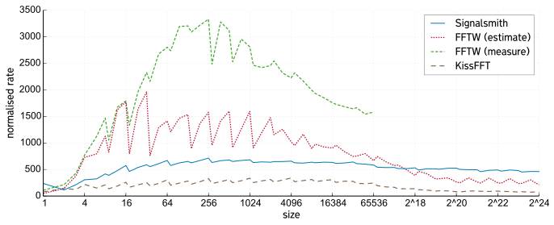

# Signalsmith FFT

A small and (reasonable) performant FFT implementation.

```cpp
#include "signalsmith-fft.h"

signalsmith::FFT<double> fft(size);
```



## Setting the size

```cpp
fft.setSize(1024);
```

It is faster for certain sizes (powers of 2, 3 and 5), and it's _strongly_ recommended that you use these.  For convenience there are two methods for finding fast sizes above and below a limit:

```cpp
actualSize = fft.setSizeMinimum(1025); // sets (and returns) a fast size >= 1025

actualSize = fft.setSizeMaximum(1025); // sets (and returns) a fast size <= 1025
```


## Forward/reverse FFT

```cpp
fft.fft(complexTime, complexSpectrum);

fft.ifft(complexSpectrum, complexTime);
```

These methods are templated, and accept any iterator or container holding a `std::complex`.  This could be a pointer (e.g. `std::complex<double> *`), or a `std::vector`, or whatever.

## Real FFT

```cpp

signalsmith::RealFFT<double> fft(size);

fft.fft(realTime, complexSpectrum);
fft.ifft(complexSpectrum, realTime);
```

The size _must_ be even.  The complex spectrum is half the size - e.g. 256 real inputs produce 128 complex outputs.

Since the 0 and Nyquist frequencies are both real, these are packed into the real/imaginary parts of index 0.
